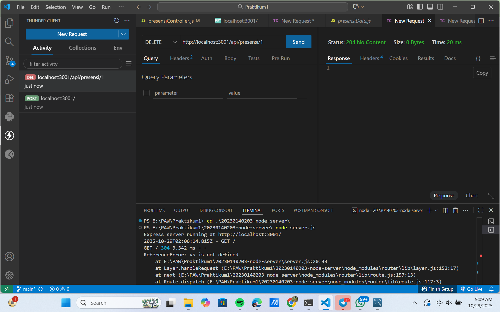
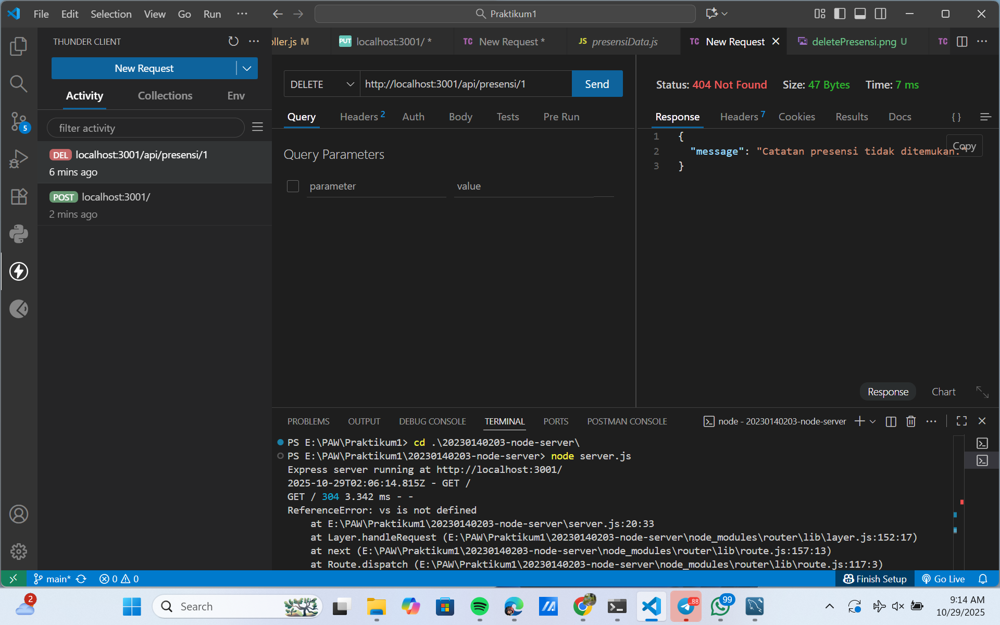
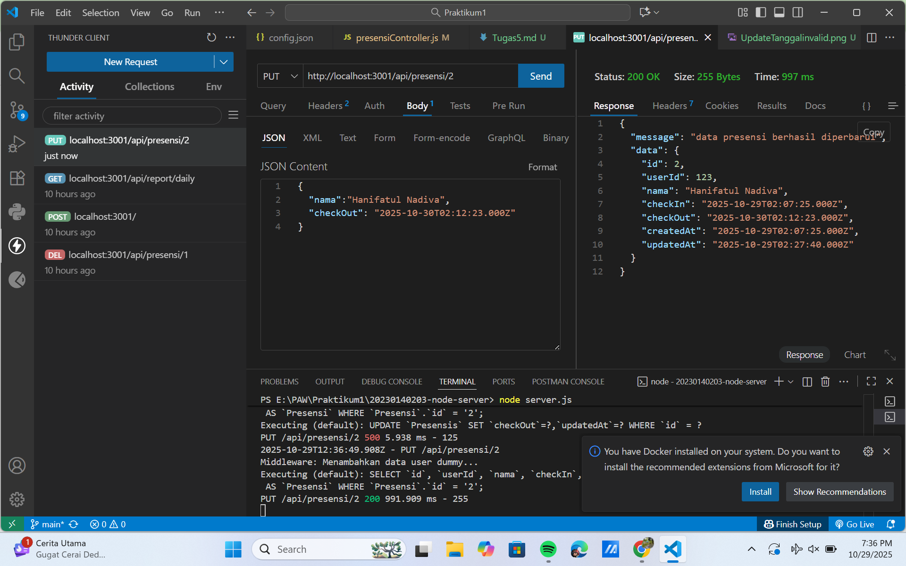
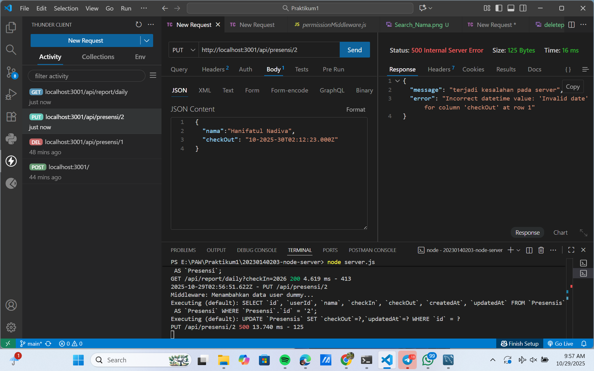
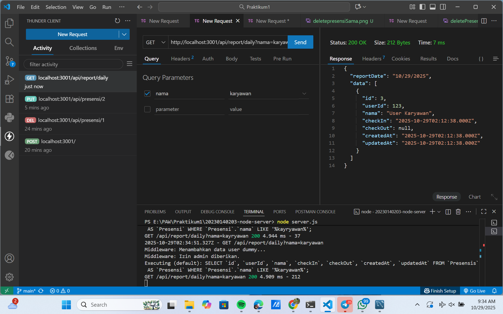
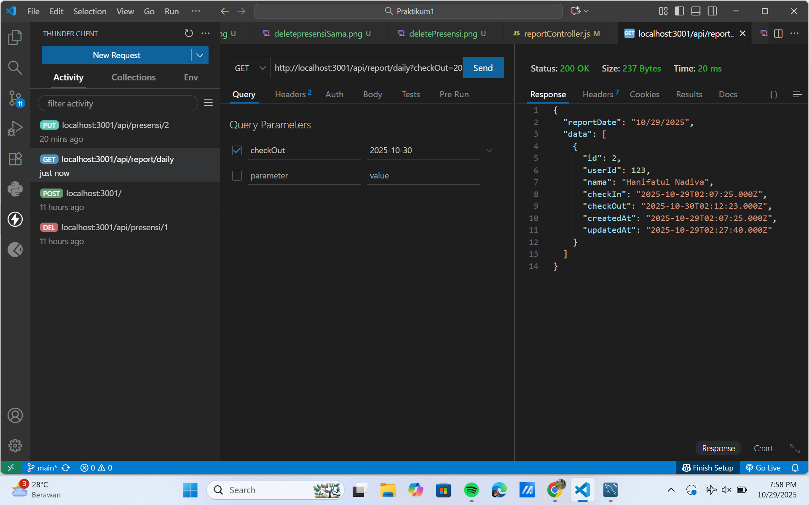

# Tugas 5

## NAMA  : HANIFATUL NADIVA
## NIM   :20230140203
## KELAS : E

# Dokumentasi
|NO|Deskripsi|Gambar|
|---|---|---|
|1|Endpoint delete data||
|2|Endpoint delete presensi dengan id yang sama||
|3|Endpoint update data berhasil||
|4|Endpoint update jika format tanggal yang diisi tidak valid||
|5|Endpoint search data berdasarkan Nama||
|6|Endpoint search data berdasarkan Tanggal CheckIn||
|7|Endpoint search data berdasarkan Tanggal CheckOut||

